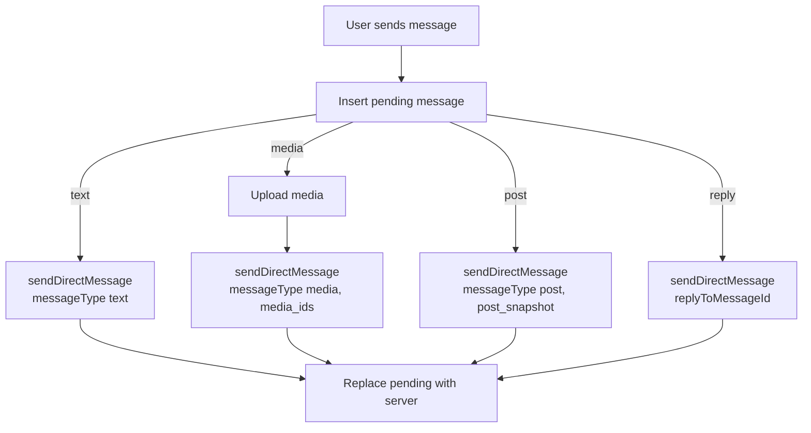
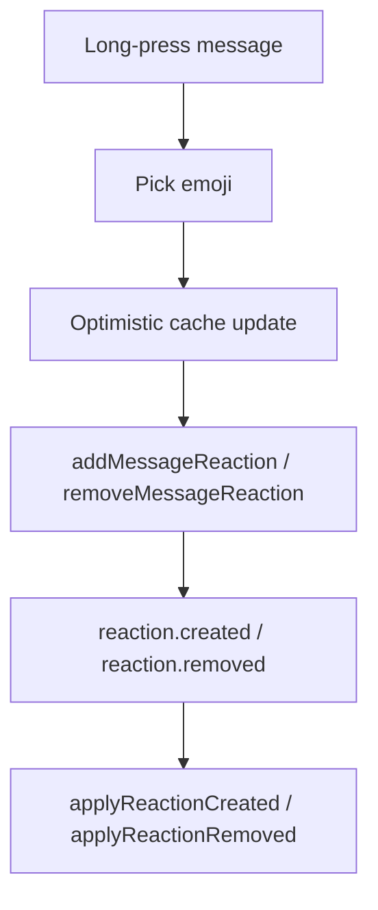
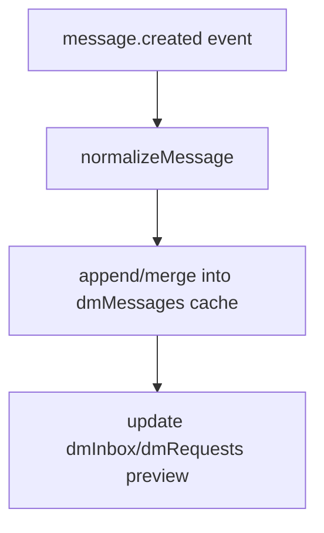
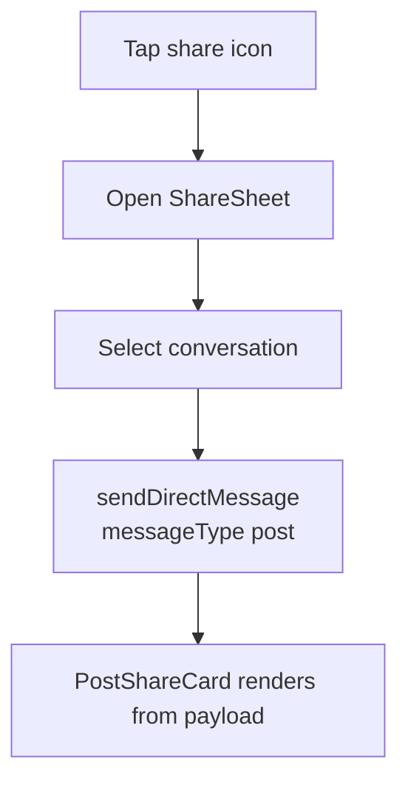

# DM Frontend Architecture and Service Usage

This document explains how the DM frontend in `src/app/dm/` interacts with the backend, the network flows for each message type, and how social sharing feeds into DMs.

## Overview

The DM UI is implemented under `src/app/dm/` and uses:
- React Query for caching and pagination.
- GraphQL for data reads and mutations.
- A WebSocket connection for real‑time updates.

This doc includes:
- Detailed API usage with code snippets.
- End‑to‑end network flows for each message type.
- Real‑time sync behavior and cache merge rules.
- Share sheet integration from the social surface.

Primary entry points:
- `src/app/dm/page.tsx` - Orchestrates data fetching, optimistic updates, and UI state.
- `src/app/dm/_queries/_fetchers.ts` - GraphQL operations.
- `src/app/dm/_queries/_operations.ts` - React Query hooks for DM ops.
- `src/app/dm/_utils/dmCache.ts` - Cache normalization and WS event merging.
- `src/app/dm/_utils/dmSocket.ts` - DM WebSocket client.

Social share integration:
- `src/app/social/_components/ShareSheet.tsx` - Share sheet UI that sends a DM post share.
- Share triggers in:
  - `src/app/social/feed/page.tsx`
  - `src/app/social/posts/post/[username]/[postId]/postView.tsx`

## Core Data Types (Frontend)

Defined in `src/app/dm/_queries/_types.ts`.

```ts
export type Message = {
  id: string;
  sender_id: string;
  sender_username?: string | null;
  message_type: string; // "text" | "media" | "post" | ...
  body?: string | null;
  payload?: Record<string, unknown> | null;
  attachments?: MessageAttachment[] | null;
  reply_to_message_id?: string | null;
  reply_to?: ReplyMessage | null;
  reaction_aggregates?: MessageReactionAggregate[] | null;
  viewer_reactions?: string[] | null;
  created_at: string;
  sequence?: number | null;
  client_id?: string | null;
  status?: "pending" | "failed";
};
```

## GraphQL API Inventory

All GraphQL operations are defined in `src/app/dm/_queries/_fetchers.ts` and used via React Query hooks from `src/app/dm/_queries/_operations.ts`.

### Inbox & Requests

```graphql
query dmInboxEntries {
  dmInboxEntries {
    conversation { id }
    otherUser { id }
    otherUsername
    otherDisplayName
    otherAvatarUrl
    lastMessagePreview
    lastMessageAt
    lastMessageSender { id }
    unreadCount
    lastSeenAt
    kind
  }
}
```

```graphql
query dmRequestEntries {
  dmRequestEntries {
    conversation { id }
    otherUser { id }
    otherUsername
    otherDisplayName
    otherAvatarUrl
    lastMessagePreview
    lastMessageAt
    lastMessageSender { id }
    unreadCount
    lastSeenAt
    kind
  }
}
```

### Message List (thread)

```graphql
query dmMessages($conversationId: ID!, $offset: Int, $limit: Int) {
  dmMessages(conversationId: $conversationId, offset: $offset, limit: $limit) {
    id
    sequence
    sender { id username }
    messageType
    body
    payload
    replyTo {
      id
      sender { id username }
      messageType
      body
      createdAt
      attachments { id }
    }
    reactionAggregates { emoji count reactedByViewer }
    viewerReactions
    createdAt
    attachments { id mediaUrl mediaType }
  }
}
```

### Single Message (reply fallback)

```graphql
query dmMessage($messageId: ID!) {
  dmMessage(messageId: $messageId) {
    id
    sequence
    sender { id username }
    messageType
    body
    payload
    replyTo {
      id
      sender { id username }
      messageType
      body
      createdAt
      attachments { id }
    }
    reactionAggregates { emoji count reactedByViewer }
    viewerReactions
    createdAt
    attachments { id mediaUrl mediaType }
  }
}
```

### Send DM (text, media, post, replies)

```graphql
mutation sendDirectMessage(
  $body: String
  $payload: JSONString
  $recipientId: ID!
  $messageType: String
  $replyToMessageId: ID
) {
  sendDirectMessage(
    body: $body
    payload: $payload
    recipientId: $recipientId
    messageType: $messageType
    replyToMessageId: $replyToMessageId
  ) {
    success
    message {
      id
      sender { id }
      messageType
      body
      payload
      createdAt
      attachments { id mediaUrl mediaType }
    }
    conversation { id }
    error
  }
}
```

### Reactions

```graphql
mutation addMessageReaction($messageId: ID!, $emoji: String!) {
  addMessageReaction(messageId: $messageId, emoji: $emoji) {
    success
    error
  }
}
```

```graphql
mutation removeMessageReaction($messageId: ID!, $emoji: String!) {
  removeMessageReaction(messageId: $messageId, emoji: $emoji) {
    success
    error
  }
}
```

### Requests + Read

```graphql
mutation acceptMessageRequest($conversationId: ID!) {
  acceptMessageRequest(conversationId: $conversationId) {
    conversation { id kind lastMessageAt lastMessagePreview }
  }
}
```

```graphql
mutation ignoreMessageRequest($conversationId: ID!) {
  ignoreMessageRequest(conversationId: $conversationId) {
    success
  }
}
```

```graphql
mutation markConversationRead($conversationId: ID!, $lastReadSequence: Int!) {
  markConversationRead(conversationId: $conversationId, lastReadSequence: $lastReadSequence) {
    success
    readCursor { lastReadSequence }
  }
}
```

## WebSocket Events

The DM WS client is implemented in `src/app/dm/_utils/dmSocket.ts`. It connects to `/ws/dm/` (or a configured WS endpoint) and merges events into React Query cache using helpers in `src/app/dm/_utils/dmCache.ts`.

Handled events:
- `message.created` → `applyMessageCreated`
- `reaction.created` → `applyReactionCreated`
- `reaction.removed` → `applyReactionRemoved`
- `conversation.updated` → `applyConversationUpdated`
- `request.created` → `applyRequestCreated`
- `request.accepted` → `applyRequestAccepted`
- `message.read` → `applyMessageRead`

## Network Flow by Message Type

### Text Message
1. User types a message.
2. An optimistic `pending` message is inserted into the cache (`appendMessageToCache`).
3. `sendDirectMessage` is called with `messageType: "text"` and `body`.
4. On success, the pending message is replaced with server data (`replacePendingWithConfirmed`).

### Media Message
1. User selects media files.
2. Files are uploaded via media services (`useMediaUpload` + `useUploadedMedia`).
3. A payload is built with `media_ids`.
4. `sendDirectMessage` is called with `messageType: "media"` and payload.
5. If server returns attachments, the pending message is merged.

### Post Share Message
1. User taps share on a post (feed or post view).
2. Share sheet opens (`src/app/social/_components/ShareSheet.tsx`).
3. User picks a conversation and taps Send.
4. `sendDirectMessage` is called with:
   - `messageType: "post"`
   - `payload.post_snapshot`
   - `payload.post_id`
5. DM thread renders the post card from payload.

### Reply Message
1. User selects Reply on a message.
2. `replyToMessageId` is passed to `sendDirectMessage`.
3. `reply_to` data is rendered inline.
4. If the reply target is missing locally, the UI fetches via `dmMessage(messageId)` and caches it.

### Reaction
1. User long‑presses the message bubble.
2. Emoji picker opens and user selects one emoji.
3. Cache updates optimistically (`updateReactionCache`).
4. GraphQL mutation (`addMessageReaction` / `removeMessageReaction`).
5. WS events keep other clients in sync.

## Auth, Tokens, and Transport

### GraphQL Auth
The GraphQL client uses the shared TagOutWest GraphQL client (`tagOutWestGraphQLClient`) which is responsible for applying auth headers. The DM layer assumes a valid auth token is present for protected operations.

### WebSocket Auth
`src/app/dm/_utils/dmSocket.ts` resolves the WS URL and appends the auth token when available:

```ts
const token = window.localStorage.getItem("authToken");
if (token) url.searchParams.set("token", token);
```

The WS URL is derived from:
- `NEXT_PUBLIC_WS_ENDPOINT`, else
- `NEXT_PUBLIC_GRAPHQL_ENDPOINT` (converted to ws), else
- `window.location.origin`.

## Pagination Strategy

DM messages use cursor‑like offset pagination via `useInfiniteQuery`:

```ts
useInfiniteQuery({
  queryKey: dmMessagesKey(conversationId),
  queryFn: ({ pageParam }) => dmMessages({
    conversationId,
    offset: typeof pageParam === "number" ? pageParam : 0,
    limit,
  }),
  getNextPageParam: (lastPage) =>
    typeof lastPage.nextOffset === "number" ? lastPage.nextOffset : undefined,
})
```

Key behaviors:
- `nextOffset` is derived from page size; when fewer than `limit` are returned, pagination ends.
- Pending messages are merged into the last page to avoid losing optimistic state.

## Error Handling and Recovery

### Send Failures
- Pending messages are marked `status: "failed"` on mutation errors.
- The UI exposes a retry action which reuses the original message payload.

### Media Upload Failures
- Media uploads are attempted before `sendDirectMessage`.
- If media IDs are missing after upload, the message is marked failed.

### WS Disconnects
- When the socket is not open, the app periodically invalidates inbox + messages to keep data fresh.
- Reconnect is exponential backoff (capped at 15s).

### Reply Fallback Failures
- If the reply target cannot be fetched, the UI renders a lightweight placeholder.

## Summary for Non‑Engineers

- DMs load from the backend with GraphQL and update live using WebSockets.
- Messages are shown immediately (optimistic) and then confirmed by the server.
- Media uploads happen first, then a message is sent with the media IDs.
- Reactions update instantly and sync to other users in real time.
- Post shares create a special “post” message that renders a compact preview card.

## Cache Interaction (React Query)

### DM Messages Cache
- Cache key: `dmMessagesKey(conversationId)`
- Stored as `InfiniteData<DmMessagesPage>`.
- Pending messages are merged into query results in `useDmMessages`.

### Inbox / Requests Cache
- Cache keys: `dmInboxKey`, `dmRequestsKey`.
- Updated by WS events and mutations.

## Mermaid Flow Diagrams

### Send Message Flow (Text / Media / Post / Reply)



### Reaction Flow



### WebSocket Message Delivery



### Share Sheet → DM Message



## Where Each Piece Lives

- DM UI + orchestration: `src/app/dm/page.tsx`
- GraphQL queries/mutations: `src/app/dm/_queries/_fetchers.ts`
- React Query hooks: `src/app/dm/_queries/_operations.ts`
- Types: `src/app/dm/_queries/_types.ts`
- WebSocket: `src/app/dm/_utils/dmSocket.ts`
- Cache merge helpers: `src/app/dm/_utils/dmCache.ts`
- Post share card in DM: `src/app/dm/_components/PostShareCard.tsx`
- Share sheet (social → DM): `src/app/social/_components/ShareSheet.tsx`

## Notes for Backend Integration

- `dmMessage(messageId: ID!)` is required for reply fallback.
- Reactions must emit WS events `reaction.created` and `reaction.removed`.
- `message.created` events must include `reply_to_message_id` (or `replyTo`) to render replies in real time.
- Post shares expect `payload.post_snapshot` and optionally `payload.post_id`.
