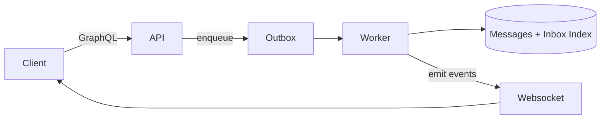
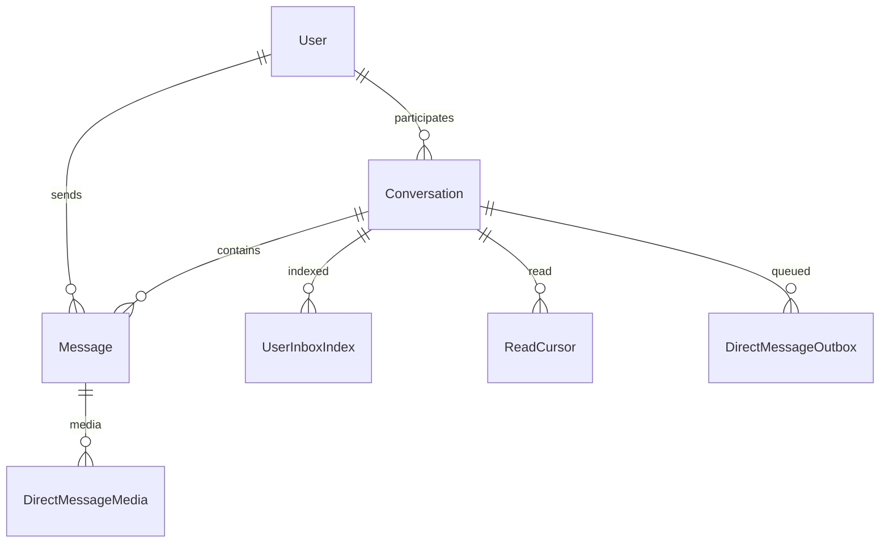
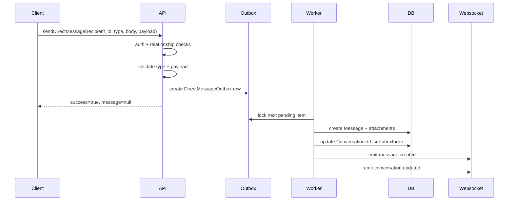
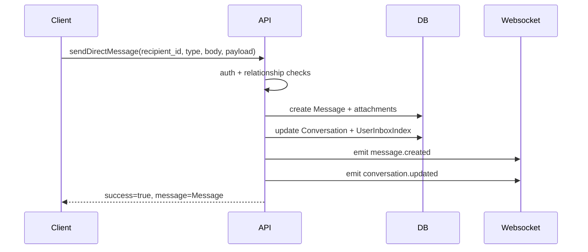
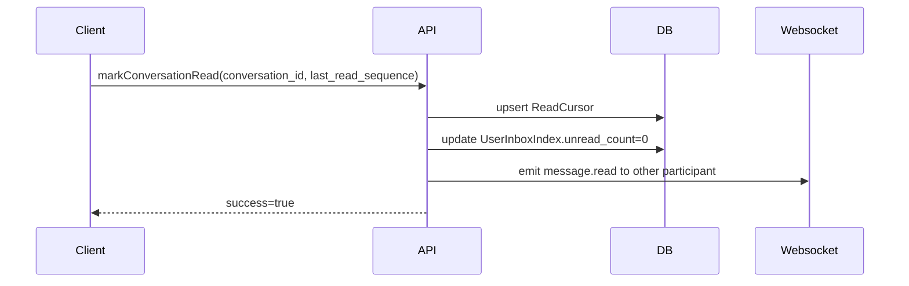

# Direct Messages Architecture

## Overview
The direct messages (DM) system supports 1:1 conversations with async persistence, realtime websocket events, and an inbox index for fast listing. The API layer is GraphQL, with a websocket channel used to broadcast message and conversation updates.

Key characteristics:
- Async persistence by default: API enqueues an outbox row; a worker processes it into a Message.
- Realtime events: messages and conversation updates are pushed to connected clients.
- Inbox index: denormalized per-user entries for fast inbox queries and unread counts.

## Core Components

### Models
- Conversation
  - Participants, kind (primary/request), last message fields.
- Message
  - Message body, type (text/media/post), payload, sequence, sender.
- UserInboxIndex
  - Per-user, per-conversation entry: preview, unread count, other user profile.
- ReadCursor
  - Per-user last read sequence in a conversation.
- DirectMessageOutbox
  - Async send queue for messages.
- DirectMessageMedia
  - Message media attachments.

### Services
- `direct_messages.services`
  - Preview generation, sequence allocation, media resolution, inbox index updates.

### GraphQL
- `direct_messages/graphql/query.py`
  - Inbox queries, conversation lookup, message lists.
- `direct_messages/graphql/mutation.py`
  - Send, accept/ignore request, read cursor updates, mute, delete.

### Realtime
- `direct_messages.events.emit_dm_event`
  - Emits websocket events to user groups.
- `direct_messages.consumers.DirectMessageConsumer`
  - Websocket consumer; forwards dm events to client.

### Worker
- `direct_messages/management/commands/process_dm_outbox.py`
  - Processes outbox rows into messages, updates inbox, emits events.

## High-Level Flow

## Data Model Relationships

## API Surface

### GraphQL Queries
- `dm_inbox(offset, limit) -> [Conversation]`
- `dm_inbox_entries(offset, limit) -> [InboxEntry]`
- `dm_requests(offset, limit) -> [Conversation]`
- `dm_request_entries(offset, limit) -> [InboxEntry]`
- `dm_conversation(conversation_id) -> Conversation`
- `dm_messages(conversation_id, offset, limit) -> [Message]`

### GraphQL Mutations
- `send_direct_message(recipient_id, message_type, body, payload)`
- `accept_message_request(conversation_id)`
- `ignore_message_request(conversation_id)`
- `mark_conversation_read(conversation_id, last_read_sequence)`
- `mute_conversation(conversation_id, is_muted)`
- `delete_conversation(conversation_id)`

### Websocket Events
Events are emitted on the authenticated user channel group `user_<id>`.
- `message.created`
- `conversation.updated`
- `request.created`
- `request.accepted`
- `message.read`

## Send Flow (Async Persistence)

### Send Flow Details
1) Authorization
   - Sender must be authenticated.
   - Relationship check: if recipient is private, sender must be friend/following/follower.
2) Validation
   - `message_type` must be in allowed set.
   - `TEXT` requires non-empty body.
   - `MEDIA` requires `payload.media_ids` list.
   - `POST` requires `payload` (post data validation is in the send path).
3) Conversation resolution
   - Find existing conversation between participants; create if missing.
   - Conversation kind becomes PRIMARY if relationship qualifies; otherwise REQUEST.
4) Outbox enqueue
   - `DirectMessageOutbox` row created with all message data.
5) Worker processing
   - Locks pending item, creates `Message` with next sequence.
   - Attaches media if needed.
   - Updates conversation preview and inbox index.
   - Emits websocket events.

## Send Flow (Sync Persistence)

## Read Flow

## Inbox Indexing
Inbox entries are denormalized for fast listing:
- Stores the other user profile fields (username, display name, avatar).
- Stores last message preview and sender.
- Tracks unread count and last seen time.

Updates occur when:
- A message is created (increment recipient unread count).
- A message is created by the same user (reset unread count to 0).
- A conversation is accepted (kind updated to PRIMARY).

## Message Types and Payloads

### TEXT
- `body` required.
- `payload` unused.

### MEDIA
- `payload.media_ids` must be a list of S3 media UUIDs.
- Attachments are resolved to `DirectMessageMedia` rows.

### POST
- `payload` contains post data for rendering a shared post card.
- The snapshot should include:
  - `post_id`
  - `post_snapshot` with author + media + caption snippet + created_at.

## Realtime Event Payloads

### message.created
Emitted to both participants.

Payload fields:
- `message_id`
- `conversation_id`
- `sender_id`
- `message_type`
- `body`
- `payload`
- `attachments`
- `sequence`
- `created_at`

### conversation.updated
Emitted to both participants after message creation or request acceptance.

Payload fields:
- `conversation_id`
- `kind`
- `last_message_id`
- `last_message_at`
- `last_message_preview`
- `updated_at`

## Failure Modes and Retries

### Outbox processing failures
- Failed items are marked `FAILED` with `last_error`.
- Operators should monitor `dm_outbox_failed` logs.
- Reprocessing requires manual status reset or manual replay.

### Rate limiting
- Enforced per sender per minute using cache keys.
- Exceeding limit returns a validation error.

### Websocket availability
- Messages are persisted even if websocket delivery fails.
- Clients should refetch messages if realtime events are missed.

## Operational Runbook

### Web service
- Start command: `daphne -b 0.0.0.0 -p $PORT tagoutwest.asgi:application`

### Worker service
- Start command: `sh -c "while true; do python manage.py process_dm_outbox --limit 100; sleep 2; done"`

### Health checks
- Confirm worker logs show `dm_outbox_processed`.
- Confirm websocket connections accept and events flow.
- Validate inbox entries and unread counts are updated.

## Security and Authorization
- Only authenticated users can access DM queries/mutations.
- Conversation access is limited to participants.
- Requests are created for non-primary relationships.
- Acceptance moves conversation to PRIMARY for both participants.

## Extension Points
Planned enhancements:
- Message replies with `reply_to` references.
- Post sharing using a snapshot payload for consistent rendering.
